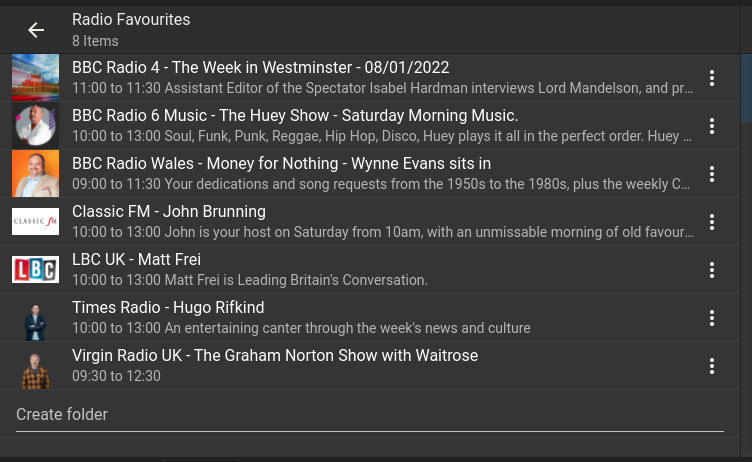
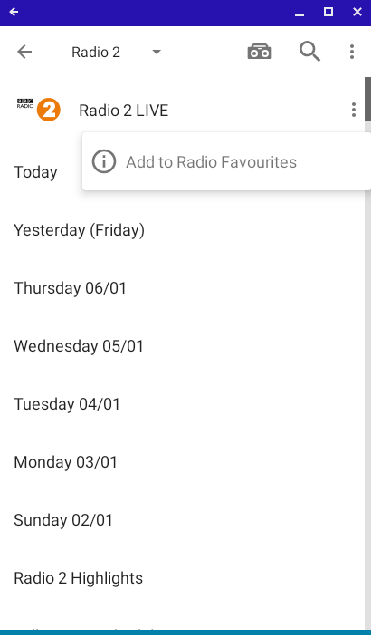
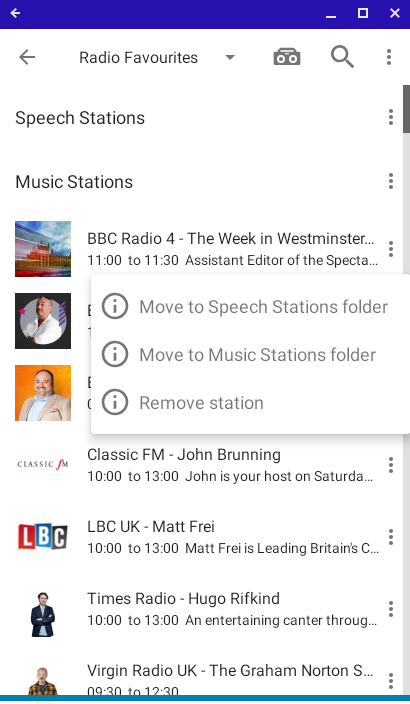

# Radio Favourites Plugin for Logitech Media Server
## What is the Radio Favourites Plugin?
The Radio Favourites Plugin allows to organise your live radio stations in a playable lists and/or folders.  It displays the programme that is currently playing on each station so that you can visually choose what to listen to.

The plugin is available to install from the 3rd party plugins list on your Logitech Media Server installation.
Once installed it is, by default, installed into your "Radio" folder.

## How does it work?
### Adding a station
To add a station to your Radio Favourites list, select the station from a compatible radio plugin (see list below for compatible plugins).  You will be able to add the station by selecting the "info" menu on the station menu option.  This is supported by all controllers.  Here is the example on "Orange Squeeze" Controller.  You press the 3 dots to bring up the option :

Using the "Material Skin" controller is similar, select the "more" menu on the info menu to access the option to add the station.

You can remove a station from your Radio Favourites by selecting info menu on the station station in your Radio Favourites folder.

### Folders
You can create folders to organise stations into groups.  Type the name of the folder in the "Create Folder" option to create the folder, then add stations to the folder by selecting the "info" menu on the station and selecting the folder.

## Compatible LMS Radio Plugins
The following are the Radio Plugins that support/compatible with the Radio Favourites plugin.  Hopefully more to follow ...

* BBC Sounds
* Times Radio
* UK Radio Player **
* Virgin Radio (UK)

**Please Note a small number of stations on UK Radio don't provide the current programme information, in particular that includes Times Radio and Virgin Radio, so use the specific plugin to add those.

