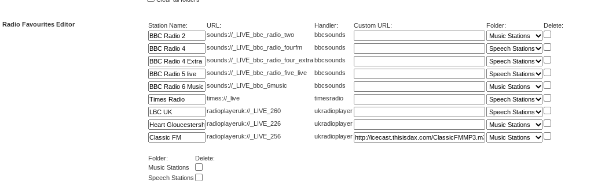

# Radio Favourites Plugin for Logitech Media Server
## What is the Radio Favourites Plugin?
The Radio Favourites Plugin allows to organise your live radio stations in a playable lists and/or folders.  It displays the programme that is currently playing on each station so that you can visually choose what to listen to.

The plugin is available to install from the 3rd party plugins list on your Logitech Media Server installation.
Once installed it is, by default, installed into your "Radio" folder.

## How does it work?
### Adding a station
To add a station to your Radio Favourites list, select the station from a compatible radio plugin (see list below for compatible plugins).  You will be able to add the station by selecting the "info" menu on the station menu option.  This is supported by all controllers.  Here is the example on "Orange Squeeze" Controller.  You press the 3 dots to bring up the option :

Using the "Material Skin" controller is similar, select the "more" menu on the info menu to access the option to add the station.  On Jive/SqueezePlay type interfaces, long press on the station to get to the "Add to Radio Favourites" option.

You can remove a station from your Radio Favourites by selecting info menu on the station station in your Radio Favourites folder.

### Folders
You can create folders to organise stations into groups.  Type the name of the folder in the "Create Folder" option to create the folder, then add stations to the folder by selecting the "info" menu on the station and selecting the folder.

Folders can also be placed in the LMS standard Favourites folder, enabling you to have your Radio Favourites in the standard LMS Favourites folder.

### Managing in the Preferences
In your LMS Settings->Advanced->Radio Favourites there is a Radio Favourites Editor available to assist in managing your favourites.

From here, you can:
* Edit the station name to your preferences
* Delete a station
* Set the folder for the station
* Set a Customer URL.  If you have a different url for a station audio that you prefer (e.g. provides a higher bitrate to the one provided by the plugin) then this url will be played instead of the plugin url when selected
* Delete a folder

## Compatible LMS Radio Plugins
The following are the Radio Plugins that support/compatible with the Radio Favourites plugin.  Hopefully more to follow ...

* BBC Sounds
* Times Radio
* Global Player (UK) 
* Virgin Radio (UK)
* UK Radio Player (Deprecated)

**Please Note UK Radio Plugin is no longer available for download

## License
The Radio Favourites plugin and all my LMS plugins, are completely free and open source, it has been developed for fun and my own use, with the hope it would be useful to others.  No donation is expected.   However, if you find it useful and would like to, you can buy me a coffee via the link below:

